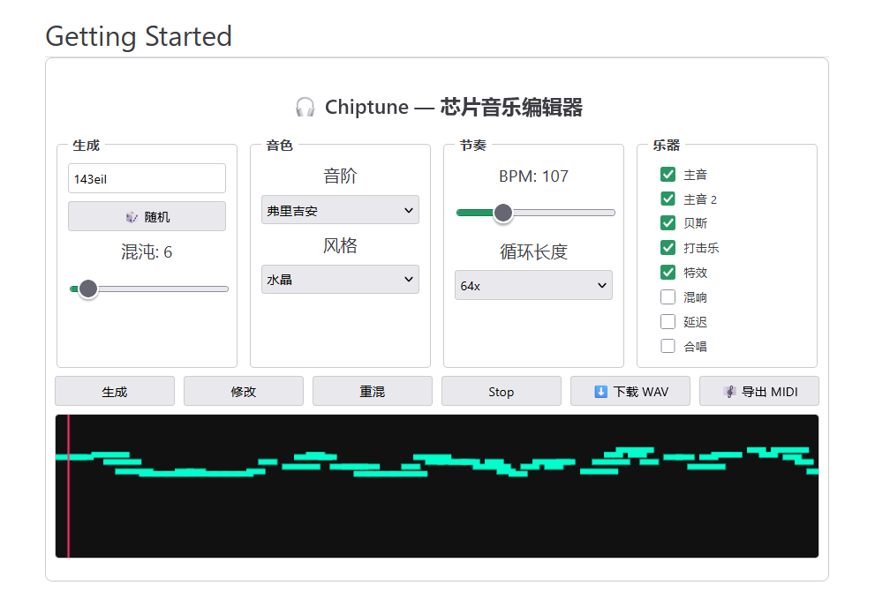

# vuepress-plugin-chiptune

> 一个用于芯片音乐（Chiptune）的 VuePress 插件。

芯片音乐（英语：Chiptune），也被称为8比特音乐（8-bit music），是一种电子音乐形式，形成于1980年代。它利用老式电脑，视频游戏机和街机等的音乐芯片，或者使用仿真器制作[1]。 芯片音乐一般包括基本波形，如方波，锯齿波或三角波和基本的打击乐器。

这个插件提供了一个交互式组件 `<Chiptune />`，允许用户在您的 VuePress 网站中创建、修改和下载芯片音乐。




## 安装

```bash
npm install vuepress-plugin-chiptune
# 或者
yarn add vuepress-plugin-chiptune
```

## 用法

将插件添加到您的 VuePress 配置中 (`.vuepress/config.js`):

```javascript
module.exports = {
  plugins: [
    ['chiptune']
  ]
}
```

然后，您可以在任何 Markdown 文件中使用该组件：

```markdown
<Chiptune />
```

## 功能

`<Chiptune />` 组件提供了一个丰富的用户界面来控制音乐生成过程：

*   **种子 (Seed)**: 用于程序生成的随机种子。
*   **混沌 (Chaos)**: 控制旋律和节奏的随机性。
*   **音阶 (Scale)**: 从多种音阶中选择，如大调、小调、五声音阶等。
*   **风格 (Style)**: 应用不同的声音预设和风格。
*   **BPM**: 调整每分钟节拍数。
*   **循环长度 (Loop Length)**: 设置循环的长度。
*   **乐器轨道 (Instrument Tracks)**: 启用或禁用主音、贝斯、打击乐和特效。
*   **效果 (Effects)**: 添加混响、延迟和合唱效果。
*   **钢琴卷帘 (Piano Roll)**: 可视化生成的音符。
*   **下载 (Download)**: 将循环导出为 WAV 或 MIDI 文件。
